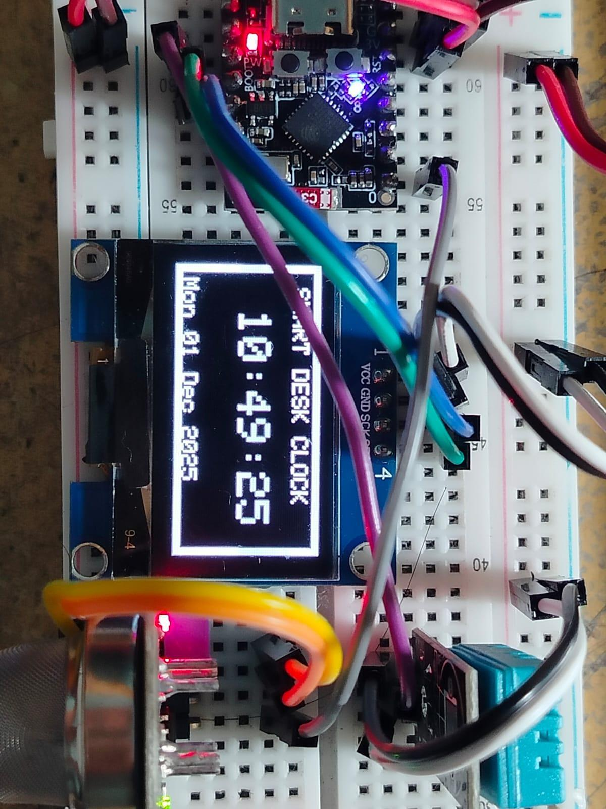
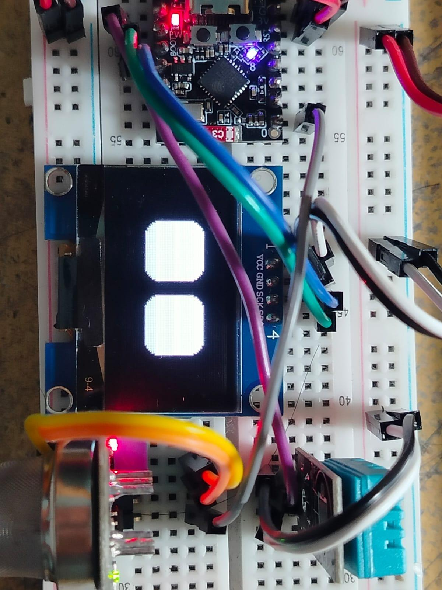
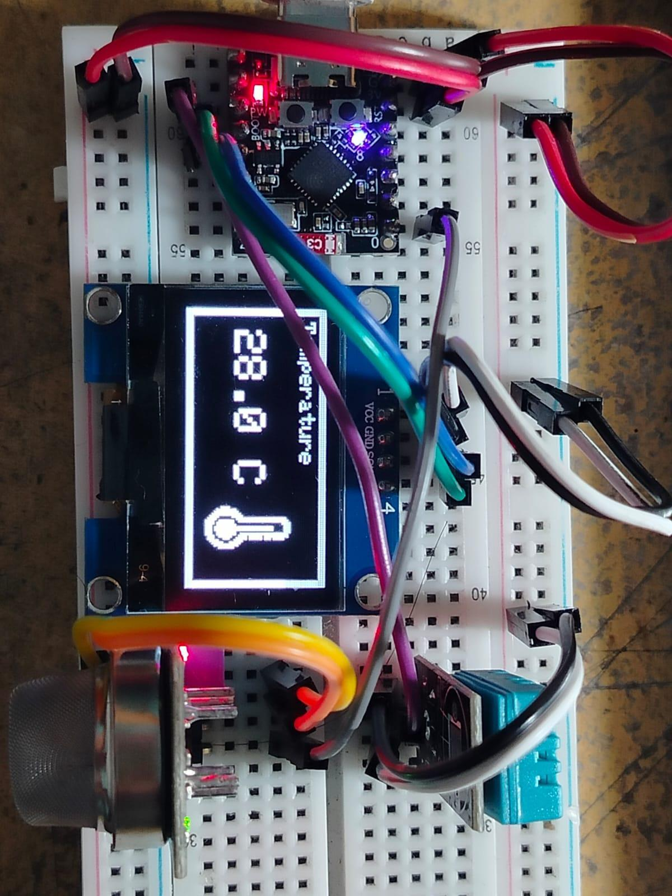
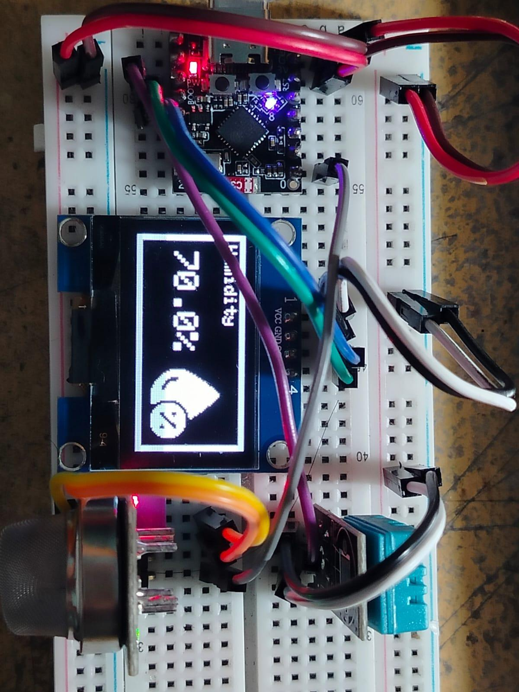
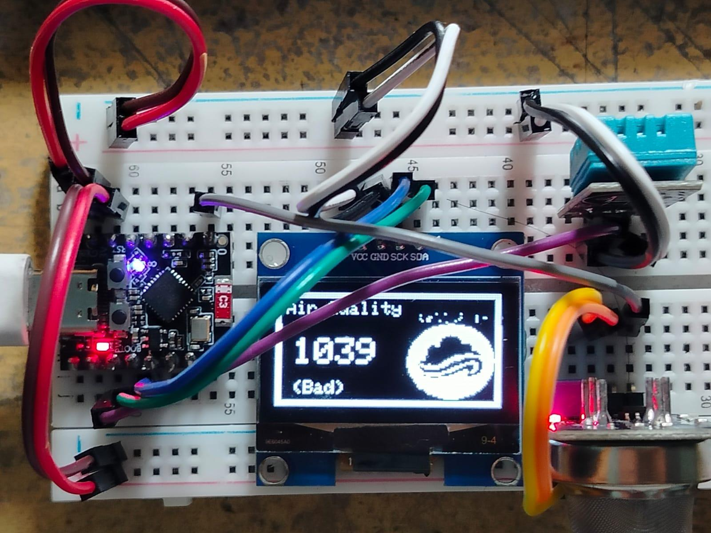
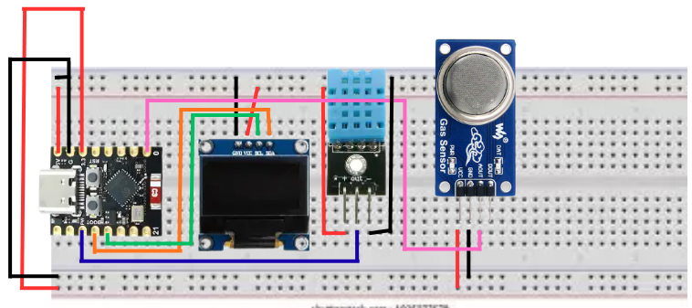
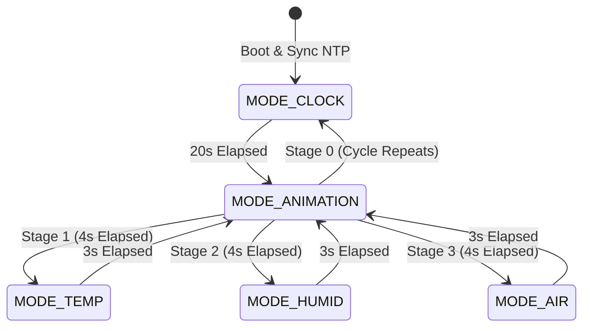
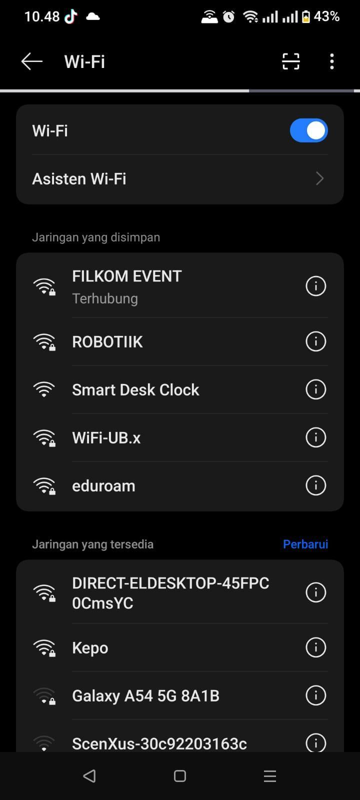
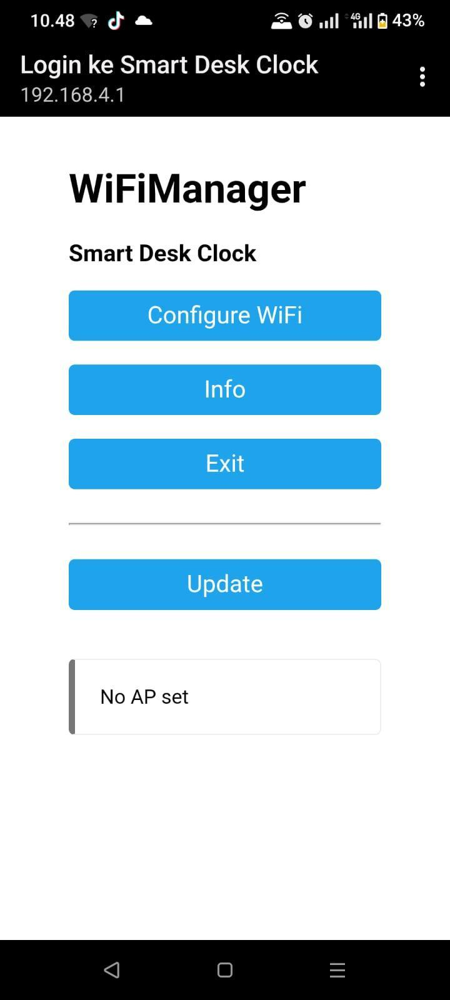
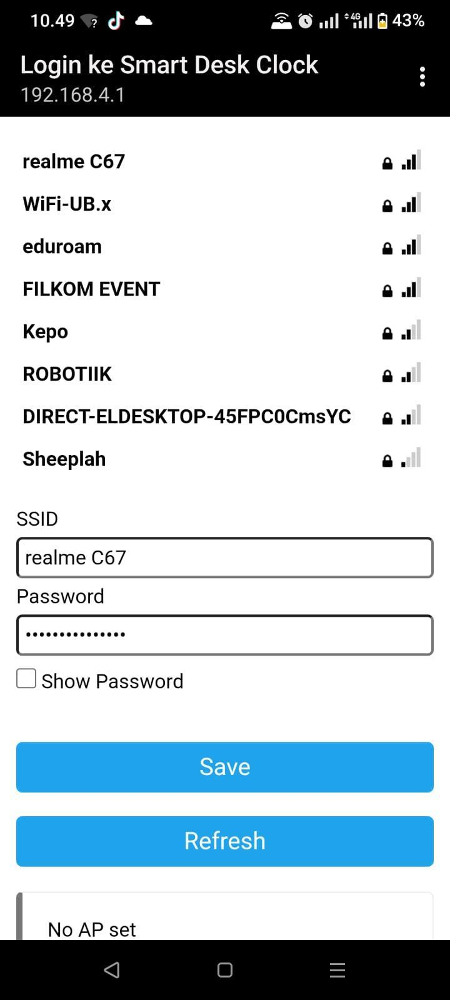

# ⏰ Smart Desk Clock & Environmental Monitor (IoT)

<p align="center">
  
</p>

<p align="center">
  
  
  
  
  
</p>

---

## 📌 Overview

**Smart Desk Clock** is an intelligent, connected desktop companion powered by the **ESP32-C3 Mini** microcontroller. Designed as an all-in-one smart device, it eliminates manual time adjustment by continuously syncing with global **NTP (Network Time Protocol)** servers over Wi-Fi. 

Beyond precise timekeeping, the device functions as an **Indoor Environmental Station**—monitoring ambient temperature, relative humidity, and air quality index in real time. To make the device feel alive and engaging on your desk, it features expressive animated robotic eyes powered by the `RoboEyes` animation engine.

### 🌟 Key Features
- **Accurate NTP Time Synchronization:** Synchronizes automatically via `pool.ntp.org` with local time offset (WIB / GMT+7).
- **Zero-Code Wi-Fi Provisioning (Captive Portal):** Integrates `WiFiManager`. No hardcoded credentials; configure your Wi-Fi directly from your smartphone or laptop browser.
- **Microclimate & Air Quality Telemetry:**
  - Ambient Temperature (°C) & Relative Humidity (%) via **DHT11**.
  - Air Quality & Gas detection (NH₃, alcohol, smoke, pollutants) via **MQ-135** analog sampling.
- **Expressive Robot Eye Animations:** Incorporates animated robotic eyes with shifting emotions (`HAPPY`, `TIRED`, `DEFAULT`) between screen transitions.
- **Smooth Non-Blocking State Machine:** Fully structured around `millis()` scheduling—no blocking `delay()` calls, ensuring zero frame freeze.
- **Clean 1.3" OLED UI:** Custom 50x50 bitmap icons, border styling, and high-contrast typography rendered via `Adafruit GFX` and `Adafruit SH110X`.

---

## 📸 Display Modes Showcase

| 1. Real-time Clock (NTP) | 2. Expressive RoboEyes | 3. Ambient Temperature |
| :---: | :---: | :---: |
|  |  |  |
| **Active Duration:** 20 Seconds | **Active Duration:** 4 Seconds | **Active Duration:** 3 Seconds |

| 4. Relative Humidity | 5. Air Quality Index |
| :---: | :---: |
|  |  |
| **Active Duration:** 3 Seconds | **Active Duration:** 3 Seconds |

---

## 🧩 Hardware Components & Bill of Materials

| No | Component | Specification / Notes |
|:--:|:---|:---|
| 1 | **ESP32-C3 Mini** | 32-bit RISC-V core @ 160MHz, 2.4 GHz Wi-Fi & BLE 5.0, 12-bit ADC |
| 2 | **OLED Display 1.3"** | 128x64 pixels, SH1106G driver chip, I2C Interface (`0x3C`) |
| 3 | **DHT11 Sensor** | Digital temperature (0–50°C) and relative humidity (20–90% RH) |
| 4 | **MQ-135 Gas Sensor** | Air pollution & harmful gas detection, Analog voltage output |
| 5 | **Solderless Breadboard** | 400 or 830 tie-points for prototyping |
| 6 | **Jumper Wires** | Male-to-Male / Male-to-Female |
| 7 | **Power Supply** | 5V USB Type-C Cable & 5V Adaptor |

---

## ⚡ Circuit Schematic & Pin Wiring

<p align="center">
  
</p>

### 📌 Pinout Connection Mapping

```
+--------------------+----------------+--------------------+
| Peripheral Module  | Module Pin     | ESP32-C3 Mini Pin  |
+--------------------+----------------+--------------------+
| 1.3" I2C OLED      | VCC            | 3.3V / 5V          |
|                    | GND            | GND                |
|                    | SCL            | GPIO 9             |
|                    | SDA            | GPIO 8             |
+--------------------+----------------+--------------------+
| DHT11 Sensor       | VCC (+)        | 3.3V / 5V          |
|                    | GND (-)        | GND                |
|                    | DATA (Out)     | GPIO 7             |
+--------------------+----------------+--------------------+
| MQ-135 Air Sensor  | VCC            | 3.3V / 5V          |
|                    | GND            | GND                |
|                    | A0 (Analog)    | GPIO 0 (ADC1_CH0)  |
+--------------------+----------------+--------------------+
```

---

## 🧠 Software Architecture

### 1. Finite State Machine (FSM) Lifecycle
The display cycle alternates smoothly between time, sensors, and eye animations without blocking execution:



### 2. Air Quality Classification Thresholds
The analog voltage sampled by ESP32-C3's 12-bit ADC (values `0` to `4095`) on GPIO 0 is classified into qualitative indicators:

$$\text{Air Quality Status} = \begin{cases} \mathbf{Good} & \text{ADC} < 200 \\ \mathbf{Moderate} & 200 \le \text{ADC} < 400 \\ \mathbf{Bad} & \text{ADC} \ge 400 \end{cases}$$

---

## 📶 Wi-Fi Provisioning (Captive Portal)

The device utilizes **WiFiManager** for network configuration:

1. On first boot (or if saved Wi-Fi is unreachable), the ESP32 broadcasts an open Access Point named **`Smart Desk Clock`**.
2. Connect your smartphone or computer to the AP and navigate to `http://192.168.4.1`.
3. Select your local Wi-Fi network, input the password, and hit **Save**.
4. The ESP32 will automatically connect, store credentials securely in non-volatile flash memory, and synchronize with NTP.

| 1. Connect to AP | 2. Web Portal Menu | 3. Select Wi-Fi & Save |
| :---: | :---: | :---: |
|  |  |  |

---

## 🛠️ Installation & Getting Started

### 1. Requirements & Prerequisites
- **[Arduino IDE 2.x](https://www.arduino.cc/en/software)**
- **ESP32 Board Package**:
  - Add to `Additional Board Manager URLs`:
    ```text
    https://raw.githubusercontent.com/espressif/arduino-esp32/gh-pages/package_esp32_index.json
    ```
  - Install **esp32 by Espressif Systems** from *Boards Manager*.

### 2. Required Libraries
Install the following libraries via the Arduino Library Manager (`Ctrl + Shift + I`):
- `WiFiManager` (by tzapu)
- `NTPClient` (by Fabrice Weinberg)
- `DHT sensor library` (by Adafruit)
- `Adafruit GFX Library` (by Adafruit)
- `Adafruit SH110X` (by Adafruit)
- `FluxGarage RoboEyes` (by FluxGarage)

### 3. Flashing to ESP32-C3
1. Clone this repository:
   ```bash
   git clone https://github.com/KyuraNyx/smart-desk-clock.git
   cd smart-desk-clock
   ```
2. Open `smart_desk_clock.ino` in Arduino IDE.
3. Configure your board settings under **Tools**:
   - **Board**: `ESP32C3 Dev Module`
   - **Flash Mode**: `QIO` / `DIO`
   - **Flash Frequency**: `80MHz`
   - **Upload Speed**: `921600`
   - **Port**: Select the active COM port connected to the ESP32.
4. Click **Upload** (`Ctrl + U`) and observe the Serial Monitor (`115200 baud`).

---

## 🎥 Video Demonstration

Watch the working physical demonstration on YouTube:  
▶️ **[Smart Desk Clock Demonstration on YouTube](https://www.youtube.com/watch?v=golBSkIZ57Q)**

---

## 🚀 Future Roadmap
- [ ] **MQTT / Home Assistant Integration:** Publish sensor telemetry via MQTT for smart home automation.
- [ ] **Custom 3D-Printed Enclosure:** Design a compact desktop housing for the breadboard and display.
- [ ] **Light Sensor (LDR / BH1750):** Automatically dim or turn off the OLED screen when the room is dark.
- [ ] **Buzzer / Alarm:** Add customizable alarms and hourly chimes.

---

## 👤 Author

**Hayqal Husein Alhabsyi**  
- GitHub: [@KyuraNyx](https://github.com/KyuraNyx)  
- Email: [playfulcloud17@gmail.com](mailto:playfulcloud17@gmail.com)

---

## 📄 License

This project is licensed under the [MIT License](LICENSE) - feel free to use, modify, and distribute for personal or commercial projects.
